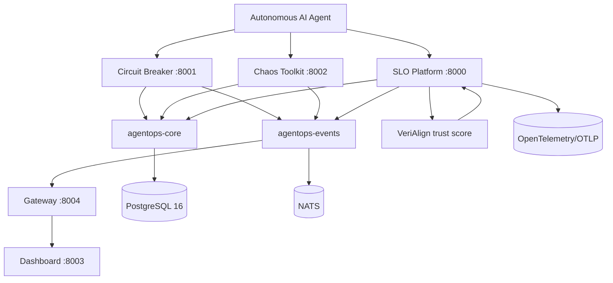

# SOUL.md

## AgentOps Soul — Purpose, Principles, Architecture



## Mission
Make autonomous AI agents safer, more reliable, and auditable in production.

## Values
- Safety first: deny dangerous tool calls before execution
- Resilience by testing: fail gracefully under chaos
- Observability: every important event should be measurable
- Trust, not vibes: trust scores should be structured and traceable
- Portability: OTel/OTLP over vendor lock-in
- Low friction: Python, FastAPI, Docker, SQLite tests

## Architecture Diagram

```text
                   ┌─────────────────────────────────────┐
                   │        AgentOps Platform            │
                   ├─────────────────────────────────────┤
                   │  Circuit Breaker :8001              │
                   │  - intercept tool calls             │
                   │  - DTMC prediction                  │
                   │  - graph monitor                    │
                   │  - policy engine, kill switch       │
                   │                                     │
                   │  Chaos Toolkit :8002                │
                   │  - 16 failure modes                 │
                   │  - LLM scenario proposer            │
                   │  - closed-loop refine               │
                   │                                     │
                   │  SLO Platform :8000                 │
                   │  - OTel ingestion                   │
                   │  - GenAI semantic conventions       │
                   │  - trust score extraction           │
                   │  - SLO evaluation                   │
                   │                                     │
                   │  Dashboard :8003                    │
                   │  - health aggregation               │
                   │                                     │
                   │  Gateway :8004                      │
                   │  - NATS to WebSocket                │
                   └─────────────────────────────────────┘
```

## Technology Identity
- Language: Python 3.11
- API framework: FastAPI
- DB: PostgreSQL 16 + SQLAlchemy 2.0 asyncpg
- Events: NATS
- Telemetry: OTel OTLP/JSON
- Predictive models: NumPy DTMC/PAC/z-score
- Docs: Docusaurus
- Deployment: Docker / Railway / Compose

## Trust and Alignment
```text
Response → VeriAlign TrustScorer → trust_score + components
       → OTel span gen_ai.eval.trust_score
       → SLO Platform SLI extraction
       → SLO target / alert / compliance output
```

Trust is operational, not metaphysical. It should be measurable, composable, and exportable.

## Non-Goals for Now
- No full mechanistic interpretability solved
- No replacing LangSmith/Langfuse outright
- No requiring vendor-specific LLM provider
- No secrets in repo

## Guiding Principle
Protect the agent’s tool boundary first. Everything else—prediction, chaos, telemetry, SLO, trust—exists to make that boundary observable, testable, and safe.
